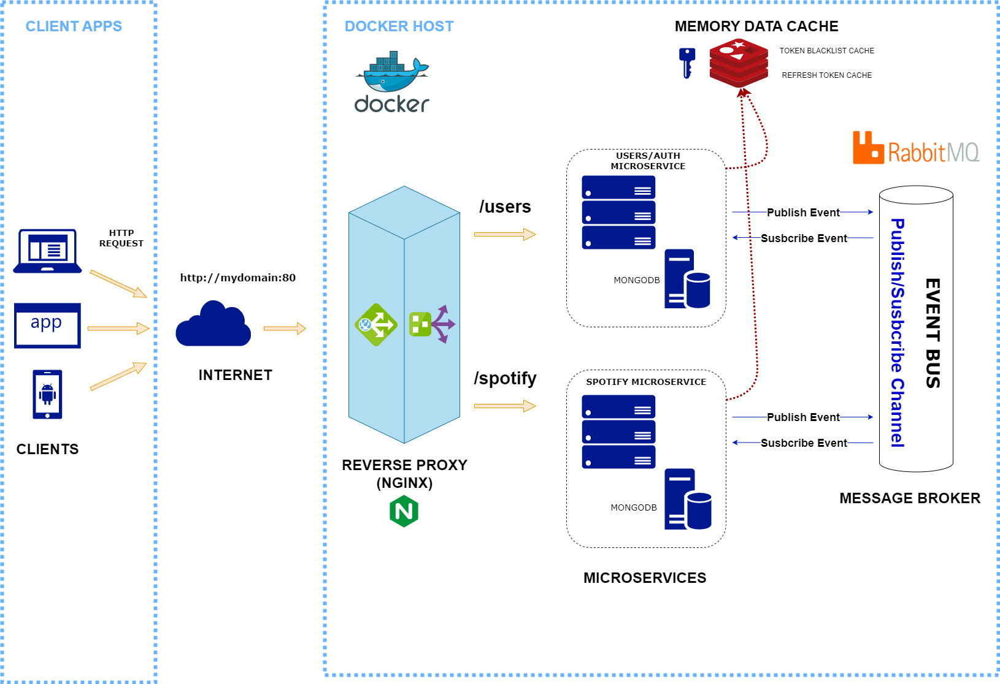
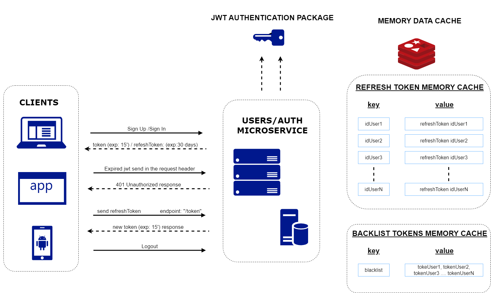

# BeatGo - Microservices Backend API & JWT Refresh Token - Blacklist Authorization process

BeatGo app microservices Backend API has been designed to showcase microservices design patterns & refresh token - Blacklist authorization process. It consists of a two lightweight services, supporting database and back end data enrichment functions.

The BeatGo microservices Backend API is based on simple REST principles. The web API endpoints return JSON metadata about music artists, albums, and tracks, directly from the Spotify Data Catalogue. It also allows user registration and login, it provides access to user related data, like playlists and music that the user saves in the Your Music library. Such access is enabled through selective authorization, by the user.

- The two microservices are both written in Node.js using the Express framework. These have been containerized so can easily be deployed & run as containers
- Two NoSQL databases document store holding JSON, provided by MongoDB.
- Reverse proxy using NGINX responsible for forwarding requests and responses between the clients and the microservices. Our primary purpose is to access our API mapping to port 80 for HTTP.
- Redis Cache Memory server used in the authorization process for storing refresh tokens (key:userId, value:refreshToken) and used tokens in a blacklist.
- Message broker using MQRabbit to provide communication between services. (Subscriber/Publisher)

The app has been designed to be containerize with Docker Compose to run all the images in the same container.

This application supports a range of demonstration, and learning scenarios, such as:

- A working example of microservices design
- Use of containers, Docker
- NoSQL and document stores over traditional relational databases
- RESTful API design
- Use of an open source application stack such as Node.js

---

# Table of Contents

- [Architecture & Core App Components](#architecture--core-app-components)
- [Getting Started](#getting-started)
- [Repository Structure](#repository-structure)
- [Fundamentals](#fundamentals)
- [Contributing](#contributing)
- [Contributors](#contributors)


---

# 🗃️ Architecture & Core App Components



# 🤘 Getting Started

There are a number of ways to get started with this project depending on your goals. Below are some suggestions and pointers

- [Running BeatGo Microservices Architecture locally with Node.js](./docs/local-dev.md) - If you're a developer interested in the building and running Node.js and/or Vue.js components locally, this is a good place to start.

## Build and Run

Prerequisites:

- [Node.js v8+ & NPM 🡽](https://nodejs.org/en/)
- [Git 🡽](https://git-scm.com/downloads)
- [MongoDB 🡽](https://www.mongodb.com/download-center/community)
- [Redis](https://redis.io/) (\*If docker is not used)

Assuming you have the pre-reqs installed and MongoDB running. A simplified "happy path" of the steps at the bash command line are:

#### 1. Clone the repo, set up local configuration env files and install Node modules (This configuration only allow you to run microservices webs API. Redis must be installed locally in your computer as a local server):

```
git clone https://github.com/alicembranos/microservices-backend.git
cd microservices
cp spotify/.env.example spotify/.env
cp users/.env.example users/.env
cd ./spotify
npm install install
cd ./users
npm install install
```

#### 2. Open two terminals and start the data API server

```
cd spotify
npm run start
cd users
npm run start
```

- [Docker Container](./docker-compose.yml) - There is available Docker container and Docker Composer if you would like to run many NodeJS Microservices.
  Build API Microservice by using following command:

```sh
docker-compose up -d --build
```

See `Dockerfile` and `docker-compose.yml` for more details.

# 💻 Repository Structure

This is a [monorepo](https://en.wikipedia.org/wiki/Monorepo) so contains multiple discreet but loosely dependant projects. The top levels of the repository directory tree are laid out as follows

```
/
├── spotify                 Base microservice folder
│   ├── node_modules        Node folder (npm install)
│   └── src                 Source microservice architecture folder
│       ├── api                 Router endpoints
│       ├── config              Projet configuration file
│       ├── database            Database seeds and connection logic
│       ├── documentation       Swagger documentation
│       ├── interfaces          Typescript interfaces
│       ├── models              Database Models
│       ├── repository          Database Methods
│       ├── services            Microservices controllers
│       ├── types               Global types
│       ├── utils               Standard functions
├── users                   Base microservice folder
│   ├── node_modules        Node folder (npm install)
│   └── src                 Source microservice architecture folder
│       ├── api                 Router endpoints
│       ├── config              Projet configuration file
│       ├── database            Database seeds and connection logic
│       ├── documentation       Swagger documentation
│       ├── interfaces          Typescript interfaces
│       ├── models              Database Models
│       ├── repository          Database Methods
│       ├── services            Microservices controllers
│       ├── types               Global types
│       ├── utils               Standard functions
└── proxy                   Nginx configuration file
```

# 🏅 Fundamentals

## :page_with_curl: API Reference & Data Model

### (1) Users - http://localhost/users (With docker) | http://localhost:4001 (Locally)

| Endpoint   | HTTP Method | CRUD Method | Result       |
| ---------- | ----------- | ----------- | ------------ |
| /user      | GET         | READ        | All users    |
| /signup    | POST        | CREATE      | Sign up user |
| /signin    | POST        | CREATE      | Login User   |
| /user/{id} | GET         | READ        | Get user     |
| /user/{id} | PATCH       | UPDATE      | Update user  |
| /user/{id} | DELETE      | DELETE      | Delete user  |

#### Swagger / OpenAPI

Swagger is generated dynamically by the Node implementation, using **express-swagger-generator** The data API server will expose this out using Swagger UI. **http://localhost:4001/doc** || **http://localhost/users/doc**

### (2) Spotify - http://localhost/spotify (With docker) | http://localhost:4002 (Locally)

| Endpoint                 | HTTP Method   | CRUD Method   | Result                             |
| ------------------------ | ------------- | ------------- | ---------------------------------- |
| ALBUMS ----------------- | ------------- | ------------- | ---------------------------------- |
| /album                   | GET           | READ          | All albums                         |
| /album/{id}              | GET           | READ          | Get album                          |
| /album/library           | PUT           | UPDATE        | Add/Remove album from library      |
| ARTISTS ---------------- | ------------- | ------------- | ---------------------------------- |
| /artist                  | GET           | READ          | All artists                        |
| /artist/{id}             | GET           | READ          | Get artist                         |
| /artist/library          | PUT           | UPDATE        | Add/Remove artist from library     |
| TRACKS ----------------- | ------------- | ------------- | ---------------------------------- |
| /track                   | GET           | READ          | All tracks                         |
| /track                   | POST          | CREATE        | Upload track                       |
| /track/{id}              | GET           | READ          | Get track                          |
| /track/library           | PUT           | UPDATE        | Add/Remove track from library      |
| PLAYLISTS -------------- | ------------- | ------------- | ---------------------------------- |
| /playlist                | GET           | READ          | All playlists                      |
| /playlist                | POST          | CREATE        | Create playlist                    |
| /playlist/{id}           | GET           | READ          | Get playist                        |
| /playlist/{id}           | PATCH         | UPDATE        | Update playlist                    |
| /playlist/{id}           | DELETE        | DELETE        | Delete playlist                    |
| /playlist/tracks/{id}    | PATCH         | UPDATE        | Add track to playlist              |
| /playlist/tracks/{id}    | DELETE        | DELETE        | Delete track to playlist           |

#### Swagger / OpenAPI

Swagger is generated dynamically by the Node implementation, using **express-swagger-generator** The data API server will expose this out using Swagger UI. **http://localhost:4002/doc** || **http://localhost/spotify/doc**

---

### Data Model

- **_Users Service_**: There are one main model, **Users**.

```ts
User {
    username: string;
    email: string;
    password: string;
    image: string;
    genres: string[];
    phone: string;
    playlists: Partial<IPlaylist>[];
    albums: Partial<IAlbum>[];
    artists: Partial<IArtist>[];
    likedSongs: Partial<ITrack>[];
    chats: IChat[];
}

```

- **_Spotify Service_**: There are four main models, **Albums**, **Artists** **Tracks**, **Playlists**.

```ts
Album {
    _id: string;
	image: string;
	title: string;
	releaseDate: Date;
	totalTracks: number;
	tracks: ITrack[];
	artist: IArtist;
}

Artist {
	_id: string;
	image: string;
	followers: number;
	name: string;
	popularity: number;
	genres: string[];
	tracks: ITrack[];
	albums: IAlbum[];
}

Track {
	_id: string;
	title: string;
	duration: number;
	trackNumber: number;
	trackAudio: string;
	album: IAlbum;
}

Playlist {
	_id: string;
	title: string;
	description: string;
	image: string;
	isPublic: boolean;
	tracks: ITrack[];
	userId: string;
}

```

## :page_with_curl: JWT refresh token & blacklist token Authorization Process



Token based authentication system using jwt with access, refresh token mechaninsm and token blacklist once the user has logged out.

Everytime the login or register flow is success, it will produce a token with expire time of 15 min and a refresh token with expire time of 30 days. The refresh token will be store in the memory cache using redis with a key - value = userId - refreshToken. Every private endpoint will pass through the authentication middleware to validate the authorization. If success , a req.user object will be create. 

If the client make a htttp request with an expired token, it must fetch to /token endpoint to get a new token. This /token endpoint will check if the userId key exists in the memory cache and if it's true, the server will respond with a new token.

On the logout process, the refrech token of the logged out user will remove from the memory cache, and the token will be add to the blacklist in the memory cache to avoid using still validated tokens.

# 🖇️ Contributing

If you want to contribute, please fork the repository, create a new branch whit your contribution, and push the branch as a pull requests.

# ✨ Contributors

Thanks goes to these superb people
